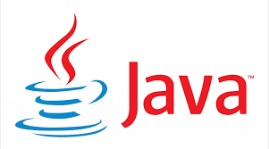

# SMR 2: INTRODUCCIÓN A LA PROGRAMACIÓN
Material para el módulo optativo de programación de 2º SMR

 
## Documentos relacionados

1. [Criterios de evaluación](criteriosEvaluacion.md)
2. [Metodología](metodologia.md)
3. [Criterios de Calificación](calificacion.md)
4. [Programación Semanal](tareas_semanales.md)

## Guía de consulta

1. [Variables, Operaciones, Entrada/Salida y Conversiones](./guias/guia.md)
2. [Uso de VSC como IDE para java](./guias/vsc.md)
3. [Funciones](./guias/funciones/guiaFunc.md)

## Recursos

* [Blockly Games](https://blockly.games/) → para iniciación a la lógica de programación sin sintaxis.
* [Scratch](https://scratch.mit.edu/) → para representar estructuras y lógica con bloques visuales.
* [JDoodle (Java)](https://www.jdoodle.com/online-java-compiler) → para escribir programas sencillos en Java sin necesidad de un IDE.
* [CodingBat (Java)](https://codingbat.com/java) → para reforzar y ampliar con ejercicios de lógica en Java.
* [IntelliJ IDEA](https://www.jetbrains.com/idea/) → para proyectos locales más completos y organización del código.