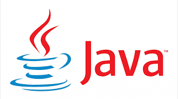

# Fundamentos de la programación (IC02) · 2.º de SMR

Materiales del curso 2026-2027. El profesor publica aquí apuntes, ejemplos y plantillas. El alumnado consulta y actualiza el repositorio; trabaja sobre copias personales y entrega por el Aula Virtual.

 

## Empezar

1. Lee el [flujo de trabajo y la organización de materiales](SESIONES_2026_27.md).
2. Consulta la [metodología](metodologia.md), la [calificación](calificacion.md) y los [resultados de aprendizaje y criterios de evaluación](criteriosEvaluacion.md).
3. Para la primera sesión, abre los [apuntes](apuntes%20y%20ejemplos/S01_Apuntes.md), el [ejemplo Java](apuntes%20y%20ejemplos/S01_HolaSMR.java) y la [actividad](tareas/S01_Actividad.md).

El recorrido previsto comprende 18 sesiones de 110 minutos entre septiembre y febrero: presentación, teoría con tests, práctica progresiva de programación y dos prácticas guiadas breves sobre ficheros y bases de datos. El profesor publicará cada material cuando corresponda; el ritmo puede ajustarse al grupo.

## Herramientas

Usaremos principalmente Java y Visual Studio Code. GitHub distribuye los materiales; las entregas se realizan en el Aula Virtual. Scratch y Blockly Games quedan como recursos de ampliación para quien avance más rápido.

## Guías de consulta

Las siguientes guías son material complementario. Su orden no representa la secuencia ni las tareas evaluables de este curso.

- [Java en VSCode](guias/vsc/vsc.md)
- [Variables, operaciones, entrada/salida y conversiones](guias/guia.md)
- [Funciones](guias/funciones/guiaFunc.md)
- [Condicionales](guias/condicional/condicional.md) y [más condicionales](guias/condicional/condicioinalV2.md)
- [Bucles con `while`](guias/bucles/1while.md)
- [Dudas sobre `Scanner`](guias/amplia/limpiaBuffer.md) y [argumentos de `main`](guias/amplia/args-main.md)
