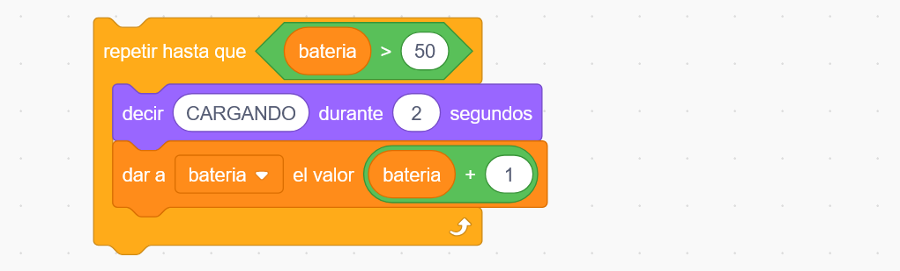
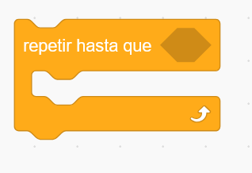

1. [Uso de VSC como IDE para java](../../guias/vsc/vsc.md) 2. [Variables, Operaciones, Entrada/Salida y Conversiones](../../guias/guia.md) 3. [Funciones](../../guias/funciones/guiaFunc.md) 4. [Condicionales](../../guias/condicional/condicional.md) 5. [Condicionales 2](../../guias/condicional/condicioinalV2.md) 6. [Bucles con while](../../guias/bucles/1while.md)

- [¿Qué es un bucle `while`?](#qué-es-un-bucle-while)
- [](#)
- [Estructura del `while` en Java](#estructura-del-while-en-java)
- [Ejemplo sencillo](#ejemplo-sencillo)
  - [Qué ocurre paso a paso:](#qué-ocurre-paso-a-paso)
- [Condición de salida (idea fundamental)](#condición-de-salida-idea-fundamental)
- [Ejemplo con entrada por teclado](#ejemplo-con-entrada-por-teclado)
- [Errores típicos a evitar](#errores-típicos-a-evitar)
- [Idea para conectar con la vida real](#idea-para-conectar-con-la-vida-real)


## ¿Qué es un bucle `while`?

Un **bucle `while`** permite **repetir un bloque de instrucciones mientras se cumpla una condición**.
La condición es una expresión lógica que solo puede dar dos resultados: `true` o `false`.

La idea clave es esta:

> **Mientras la condición sea verdadera, el código se repite.**
> **Cuando deja de serlo, el bucle termina.**


---

## Estructura del `while` en Java

```java
while (condición) {
    // instrucciones que se repiten
}
```


* **condición**: se evalúa **antes de cada repetición**.
* Si la condición es `false` desde el principio, **el bucle no se ejecuta ni una sola vez**.

---

## Ejemplo sencillo

Cargar batería hasta 50%:

```java
int bateria = 1;

while (bateria <= 50) {
    System.out.println("Cargando");
    bateria++;
}
```

### Qué ocurre paso a paso:

1. `bateria` empieza valiendo 1.
2. Se comprueba `bateria <= 50`.
3. Si es `true`, se ejecuta el bloque.
4. `bateria++` modifica la variable.
5. Se vuelve a comprobar la condición.

---

## Condición de salida (idea fundamental)

Todo `while` **debe tener una forma clara de terminar**.

En el ejemplo anterior, el bucle termina porque:

* `bateria` va aumentando.
* Llega un momento en que `bateria <= 5` es `false`.

Si la condición **nunca cambia**, el bucle será **infinito**.

---

## Ejemplo con entrada por teclado

Pedir números hasta que el usuario escriba 0:

```java
Scanner sc = new Scanner(System.in);
int numero;

System.out.print("Introduce un número (0 para salir): ");
numero = sc.nextInt();

while (numero != 0) {
    System.out.println("Has introducido: " + numero);
    System.out.print("Introduce otro número (0 para salir): ");
    numero = sc.nextInt();
}
```

Aquí:

* La **condición controla cuándo se termina**.
* El usuario decide cuándo salir.

---

## Errores típicos a evitar

* ❌ No modificar la variable de la condición dentro del bucle.
* ❌ Pensar que el `while` se ejecuta al menos una vez (eso no es cierto).
* ❌ Usar condiciones mal planteadas que nunca llegan a ser `false`.

---

## Idea para conectar con la vida real

Un `while` es como decir:

> “Mientras el semáforo esté en rojo, sigo parado”.

En el momento en que deja de estar en rojo, **sales del bucle** y continúas con el programa.