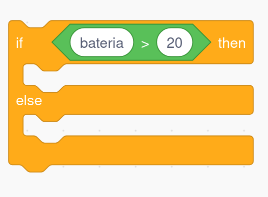

1. [Uso de VSC como IDE para java](../../guias/vsc/vsc.md) 2. [Variables, Operaciones, Entrada/Salida y Conversiones](../../guias/guia.md) 3. [Funciones](../../guias/funciones/guiaFunc.md) 4. [Condicionales](../../guias/condicional/condicional.md) 5. [Condicionales 2](../../guias/condicional/condicioinalV2.md) 6. [Bucles con while](../../guias/bucles/1while.md)

- [🧭 **Guía Avanzada de Condicionales**](#-guía-avanzada-de-condicionales)
    - [1. ¿qué sabemos ya?](#1-qué-sabemos-ya)
    - [2. `if / else`: cuando solo puede ocurrir una de dos cosas](#2-if--else-cuando-solo-puede-ocurrir-una-de-dos-cosas)
    - [3. `else if`: cuando hay más de dos posibilidades](#3-else-if-cuando-hay-más-de-dos-posibilidades)
    - [4. Operadores lógicos: construyendo condiciones más precisas](#4-operadores-lógicos-construyendo-condiciones-más-precisas)
      - [✔ `&&` (y): se deben cumplir las dos](#--y-se-deben-cumplir-las-dos)
      - [✔ `||` (o): basta con que se cumpla una](#--o-basta-con-que-se-cumpla-una)
      - [✔ `!` (no): niega una condición](#--no-niega-una-condición)
    - [5. Rango de valores: pensar en intervalos](#5-rango-de-valores-pensar-en-intervalos)
    - [6. Errores avanzados que deben evitar](#6-errores-avanzados-que-deben-evitar)
    - [7. Aplicaciones reales para futuros técnicos](#7-aplicaciones-reales-para-futuros-técnicos)
      - [🔹 Diagnóstico básico de red](#-diagnóstico-básico-de-red)
      - [🔹 Validación de usuario](#-validación-de-usuario)
      - [🔹 Comprobación de nota](#-comprobación-de-nota)
  - [8. Resumen](#8-resumen)


# 🧭 **Guía Avanzada de Condicionales**


### 1. ¿qué sabemos ya?


* Qué es una condición
* Que toda condición responde SÍ o NO
* A identificar “condición + acción”
* A escribir `if` básico

Hoy construiremos sobre eso: **si la respuesta es NO, ¿qué ocurre?**
Y ¿qué pasa cuando hay **VARIAS** preguntas que decidir?

---

### 2. `if / else`: cuando solo puede ocurrir una de dos cosas

Ejemplo del día a día:

> “Si el móvil tiene más del 20% de batería → sigo usando GPS.
> En otro caso → ahorro batería.”

En Java:

```java
if (bateria > 20) {
    System.out.println("Puedes seguir usando el GPS.");
} else {
    System.out.println("Activa el modo ahorro.");
}
```


Es una decisión **binaria**.

---

### 3. `else if`: cuando hay más de dos posibilidades

Caso típico: clasificar rangos.

Ejemplo cercano al mundo de SMR:

> “Según la intensidad de la señal WiFi, indico el estado.”

```java
if (senal >= -50) {
    System.out.println("Señal excelente");
} else if (senal >= -65) {
    System.out.println("Buena");
} else if (senal >= -80) {
    System.out.println("Regular");
} else {
    System.out.println("Muy débil");
}
```


Tres ideas clave:

1. Las condiciones se evalúan **en orden**.
2. La primera que sea verdadera **gana**.
3. El `else` final es opcional pero útil para “todo lo que no sea lo anterior”.

---

### 4. Operadores lógicos: construyendo condiciones más precisas

#### ✔ `&&` (y): se deben cumplir las dos

```java
if (edad >= 0 && edad <= 120) {
    System.out.println("Edad válida.");
}
```

#### ✔ `||` (o): basta con que se cumpla una

```java
if (rol.equals("admin") || rol.equals("supervisor")) {
    System.out.println("Permiso avanzado.");
}
```

#### ✔ `!` (no): niega una condición

```java
if (!conectado) {
    System.out.println("No hay conexión a Internet.");
}
```

---

### 5. Rango de valores: pensar en intervalos

Este tipo de razonamiento aparece constantemente en programación.

Ejemplo típico de clasificación:

```java
if (edad >= 0 && edad <= 12) {
    System.out.println("Niño");
} else if (edad >= 13 && edad <= 17) {
    System.out.println("Adolescente");
} else if (edad >= 18) {
    System.out.println("Adulto");
} else {
    System.out.println("Edad inválida");
}
```

Clave didáctica para ellos:
Primero validar, después clasificar.

---

### 6. Errores avanzados que deben evitar

1. **Solapar rangos**

   ```java
   if (edad >= 0 && edad <= 12)
   else if (edad <= 17)    // mal: no comprueba mínimo
   ```

2. **Orden incorrecto de casos**
   Primero debe ir el caso más restrictivo o más obvio.

3. **Condiciones incompletas**

   ```java
   if (nota < 5) { … }
   else if (nota < 7) { … }   // debería poner nota >= 5 && nota < 7
   ```

4. **Comparar Strings con `==`**
   Siempre `.equals()` o `.equalsIgnoreCase()`.


### 7. Aplicaciones reales para futuros técnicos

#### 🔹 Diagnóstico básico de red

```java
if (!cableConectado) {
    System.out.println("Conecta el cable de red.");
} else if (!tieneIp) {
    System.out.println("No hay IP asignada.");
} else if (!hayPing) {
    System.out.println("No hay comunicación con el router.");
} else {
    System.out.println("Conexión OK.");
}
```

#### 🔹 Validación de usuario

```java
if (user.equals("admin") && pass.equals("1234")) {
    System.out.println("Bienvenido.");
} else {
    System.out.println("Credenciales incorrectas.");
}
```

#### 🔹 Comprobación de nota

```java
if (nota < 0 || nota > 10) {
    System.out.println("Nota inválida.");
} else {
    System.out.println("Nota correcta.");
}
```


## 8. Resumen

1. `if / else` → dos caminos
2. `else if` → varias alternativas
3. `&&` y `||` → condiciones más ricas
4. **Orden** de las condiciones = esencial
5. Validar antes de clasificar
6. Comparar Strings con `.equals()`


