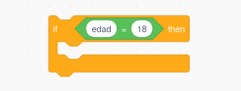

1. [Uso de VSC como IDE para java](../../guias/vsc/vsc.md) 2. [Variables, Operaciones, Entrada/Salida y Conversiones](../../guias/guia.md) 3. [Funciones](../../guias/funciones/guiaFunc.md) 4. [Condicionales](../../guias/condicional/condicional.md) 5. [Condicionales 2](../../guias/condicional/condicioinalV2.md) 6. [Bucles con while](../../guias/bucles/1while.md)

- [🧭 **Guía de Introducción a los Condicionales**](#-guía-de-introducción-a-los-condicionales)
  - [🎯 **Objetivo de la sesión**](#-objetivo-de-la-sesión)
- [1. ¿Qué es un condicional?](#1-qué-es-un-condicional)
- [2. La idea clave: **toda condición responde SÍ o NO**](#2-la-idea-clave-toda-condición-responde-sí-o-no)
- [3. Antes del código: ¿dónde está la condición?](#3-antes-del-código-dónde-está-la-condición)
- [4. El condicional en pseudocódigo](#4-el-condicional-en-pseudocódigo)
- [5. El condicional en Java (versión mínima)](#5-el-condicional-en-java-versión-mínima)
- [6. Errores típicos que deben evitar desde el principio](#6-errores-típicos-que-deben-evitar-desde-el-principio)
- [7. Actividad rápida en clase (5 minutos)](#7-actividad-rápida-en-clase-5-minutos)
- [8. Ejemplos aplicados al mundo real de la informática](#8-ejemplos-aplicados-al-mundo-real-de-la-informática)
    - [🔹 Validación de entrada](#-validación-de-entrada)
    - [🔹 Control de acceso](#-control-de-acceso)
    - [🔹 Comprobación de red](#-comprobación-de-red)
- [9. Mini-proyecto para el final de la clase (10 minutos)](#9-mini-proyecto-para-el-final-de-la-clase-10-minutos)
    - [✔ Detectar mayoría de edad](#-detectar-mayoría-de-edad)
    - [✔ Comprobador básico de contraseña](#-comprobador-básico-de-contraseña)
    - [✔ Detector de temperatura fría](#-detector-de-temperatura-fría)
- [🧩 Contenido que queda para la siguiente sesión](#-contenido-que-queda-para-la-siguiente-sesión)

# 🧭 **Guía de Introducción a los Condicionales**

**Fundamentos de la Programación – GM SMR**

## 🎯 **Objetivo de la sesión**

Comprender qué es un condicional, para qué sirve y cómo se usa en programación a través de ejemplos reales y código muy básico.

---

# 1. ¿Qué es un condicional?

Un **condicional** es una decisión:
Una forma de decirle al ordenador:

👉 *“Si ocurre esto, haz esto otro.”*

Los programas toman decisiones igual que las personas:

* *“Si llueve, cojo paraguas.”*
* *“Si la batería baja del 10%, modo ahorro.”*
* *“Si el usuario escribe la contraseña correcta, entra.”*

---

# 2. La idea clave: **toda condición responde SÍ o NO**

Esto es fundamental.

Una condición siempre es una **pregunta que se puede responder con verdadero o falso**:

* ¿La edad es mayor o igual que 18?
* ¿La contraseña está vacía?
* ¿La temperatura es menor que 0?

Si la respuesta es **sí**, ocurre una acción.
Si es **no**, ocurre otra o no ocurre nada.

---

# 3. Antes del código: ¿dónde está la condición?

Observa este ejemplo:

> “Si la nota es mayor o igual que 5, muestra ‘Aprobado’.”

* **Condición:** “nota ≥ 5”
* **Acción:** mostrar “Aprobado”

Otros ejemplos rápidos:

* Si *edad < 0* → “Error: edad inválida”
* Si *usuario == 'admin'* → “Acceso autorizado”
* Si *temperatura < 0* → “Hace frío”

Ellos deben identificar condición + acción. Nada más.

---

# 4. El condicional en pseudocódigo

Antes de ver Java, lo expresamos en un lenguaje neutro:

```
SI (edad >= 18)
    mostrar "Mayor de edad"
FIN SI
```

```
SI (temperatura < 0)
    mostrar "Hace frío"
FIN SI
```

Esto facilita que entiendan la estructura sin preocuparse por la sintaxis.

---

# 5. El condicional en Java (versión mínima)

Una vez entendido lo anterior, lo llevamos a Java:

```java
if (edad >= 18) {
    System.out.println("Mayor de edad");
}
```


Otro ejemplo:

```java
if (temperatura < 0) {
    System.out.println("Hace frío");
}
```

Nada más por hoy:
**solo if sencillo**, sin else, sin else-if, sin operadores lógicos.

---

# 6. Errores típicos que deben evitar desde el principio

* Escribir `=` en vez de `==` → un clásico.
* Olvidar llaves `{ }`.
* Comparar decimales esperando coincidencias exactas.
* Escribir condiciones que siempre son verdaderas o falsas.

Esto les prepara para depurar con criterio.

---

# 7. Actividad rápida en clase (5 minutos)

Tú lees en voz alta situaciones; cada alumno dice si la condición es **VERDADERA** o **FALSA**.

Ejemplos:

1. Edad: 15
   Condición: “edad ≥ 18”
2. Temperatura: –3
   Condición: “temperatura < 0”
3. Nombre: “Juan”
   Condición: “nombre == ‘admin’”
4. Nota: 9.5
   Condición: “nota < 5”

Esto les entrena a pensar como un programa antes de programar.

---

# 8. Ejemplos aplicados al mundo real de la informática

Para conectar con su futura profesión:

### 🔹 Validación de entrada

```java
if (edad < 0) {
    System.out.println("Error: edad inválida.");
}
```

### 🔹 Control de acceso

```java
if (rol.equals("admin")) {
    System.out.println("Acceso permitido.");
}
```

### 🔹 Comprobación de red

```java
if (!conectado) {
    System.out.println("Revisa el cable de red.");
}
```

Con esto ven que los condicionales **están en todos los sistemas y aplicaciones**.

---

# 9. Mini-proyecto para el final de la clase (10 minutos)

Pueden escribir uno de estos:

### ✔ Detectar mayoría de edad

Piden la edad y muestran si es válido o no.

### ✔ Comprobador básico de contraseña

Comprobar si una contraseña introducida está vacía.

### ✔ Detector de temperatura fría

Pedir temperatura y mostrar si está bajo cero.

Son ejercicios breves que consolidan la idea.

---

# 🧩 Contenido que queda para la siguiente sesión

En la hora siguiente trabajarán:

1. `if / else`
2. `else if`
3. Condiciones múltiples (`&&`, `||`)
4. Ejercicios progresivos
5. Mini-problemas aplicados

---
