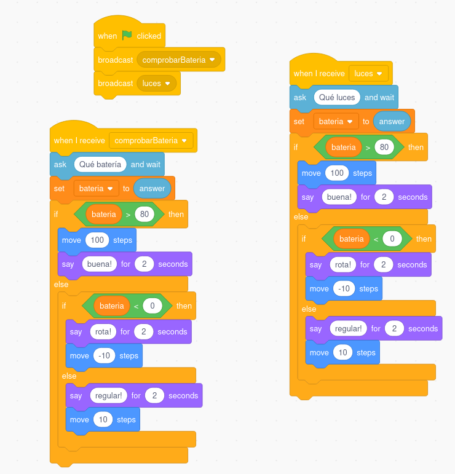
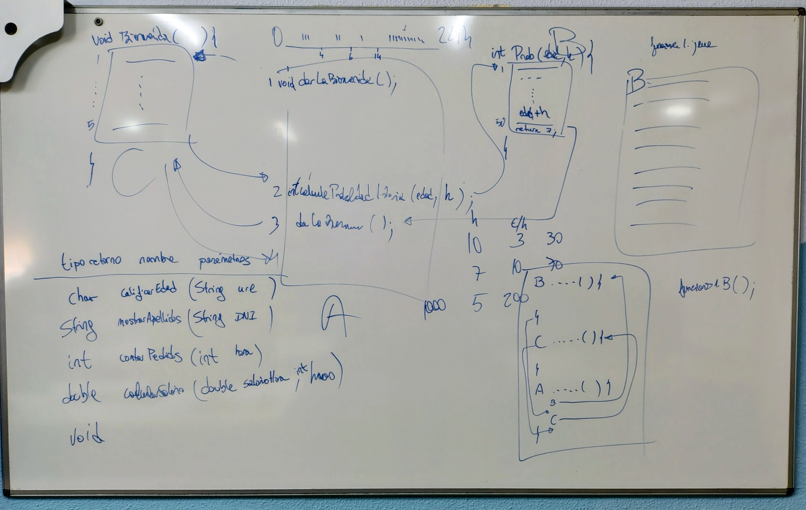

1. [Uso de VSC como IDE para java](../../guias/vsc/vsc.md) 2. [Variables, Operaciones, Entrada/Salida y Conversiones](../../guias/guia.md) 3. [Funciones](../../guias/funciones/guiaFunc.md) 4. [Condicionales](../../guias/condicional/condicional.md) 5. [Condicionales 2](../../guias/condicional/condicioinalV2.md) 6. [Bucles con while](../../guias/bucles/1while.md)

- [📘 Guía: Introducción a las funciones en programación](#-guía-introducción-a-las-funciones-en-programación)
  - [1️⃣ ¿Por qué usamos funciones?](#1️⃣-por-qué-usamos-funciones)
  - [2️⃣ Primer ejemplo: una función simple](#2️⃣-primer-ejemplo-una-función-simple)
  - [3️⃣ Funciones con parámetros](#3️⃣-funciones-con-parámetros)
  - [4️⃣ Funciones que devuelven valores](#4️⃣-funciones-que-devuelven-valores)
  - [5️⃣ Programa completo con varias funciones](#5️⃣-programa-completo-con-varias-funciones)
  - [⚠️ 6️⃣ Dificultades frecuentes y cómo superarlas](#️-6️⃣-dificultades-frecuentes-y-cómo-superarlas)
  - [🧠 7️⃣ Para reflexionar](#-7️⃣-para-reflexionar)
  - [✅ 8️⃣ Actividad propuesta](#-8️⃣-actividad-propuesta)
    - [Pizarra explicación](#pizarra-explicación)


# 📘 Guía: Introducción a las funciones en programación




## 1️⃣ ¿Por qué usamos funciones?

Imagina que estás escribiendo un programa que muestra mensajes en pantalla varias veces:

```java
System.out.println("Bienvenido al programa");
System.out.println("Bienvenido al programa");
System.out.println("Bienvenido al programa");
```

Funciona… pero si mañana quieres cambiar el mensaje, tendrás que hacerlo **en tres sitios diferentes**.
Las funciones nos ayudan a **reutilizar código**: escribes una vez un bloque de instrucciones y lo usas tantas veces como quieras.

> 💡 Una **función** es un conjunto de instrucciones con un nombre que se puede ejecutar (llamar) desde cualquier parte del programa.

---

## 2️⃣ Primer ejemplo: una función simple

```java
public static void saludar() {
    System.out.println("Hola, mundo!");
}
```

Y en el programa principal:

```java
public static void main(String[] args) {
    saludar();
    saludar();
}
```

💬 **Qué ocurre:**

* El programa empieza en `main`.
* Cada vez que encuentra `saludar();`, “salta” a ejecutar la función y luego vuelve donde estaba.

**Ventaja:** el código se repite sin tener que copiarlo.

👉 Usar el debugger para ver por dónde **avanza el flujo de control** (si no lo tienes, instala una extensión adecuada en VSC)

---

## 3️⃣ Funciones con parámetros

A veces queremos que la función trabaje con datos distintos. Para eso usamos **parámetros**.

```java
public static void saludar(String nombre) {
    System.out.println("Hola, " + nombre + "!");
}

public static void main(String[] args) {
    saludar("María");
    saludar("Luis");
}
```

💬 **Qué ocurre:**

* La función `saludar` recibe el dato `"María"` o `"Luis"`.
* Dentro de la función, ese dato se guarda en la variable `nombre`.

📌 **Concepto clave:** los parámetros permiten que una misma función sirva para muchos casos distintos.

👉 Usar el debugger para ver **cómo cambia el valor del parámetro** y por dónde avanza el flujo.

---

## 4️⃣ Funciones que devuelven valores

Algunas funciones no solo hacen algo, sino que **devuelven un resultado**.

```java
public static int sumar(int a, int b) {
    return a + b;
}

public static void main(String[] args) {
    int resultado = sumar(3, 5);
    System.out.println("La suma es: " + resultado);
}
```

💬 **Qué ocurre:**

* La función calcula `3 + 5` y devuelve el resultado.
* El valor devuelto se guarda en `resultado`.

📌 **Importante:** el tipo de dato del `return` (aquí `int`) debe coincidir con el declarado en la función.

👉 Usar el debugger para ver **cómo cambia el valor del parámetro** y por dónde avanza el flujo.

---

## 5️⃣ Programa completo con varias funciones

Un ejemplo más completo: **calcular áreas de figuras.**

```java
import java.util.Scanner;

public class Areas {

    public static double calcularAreaTriangulo(double base, int altura) {
        return base * altura / 2;
    }

    public static double calcularAreaCuadrado(double base) {
        return base * base;
    }


    public static void main(String[] args) {
        Scanner sc = new Scanner(System.in);

        System.out.print("Introduce base: ");
        double base = sc.nextDouble();

        System.out.print("Introduce altura: ");
        double altura = sc.nextDouble();

        double areaCuadrado;
        double areaTriangulo;

        areaCuadrado = calcularAreaCuadrado(base);
        areaTriangulo = calcularAreaTriangulo(base, altura);

        System.out.println("Área del cuadrado: " + areaCuadrado);
        System.out.println("Área del triángulo: " + areaTriangulo);
    }
}
```

💬 **Qué estás practicando aquí:**

* Definición y llamada de funciones.
* Paso de parámetros.
* Uso del valor devuelto (`return`).

---

## ⚠️ 6️⃣ Dificultades frecuentes y cómo superarlas

| Dificultad                                                       | Ejemplo                                                               | Qué ocurre                                                                               | Cómo corregir                                                                               |
| ---------------------------------------------------------------- | --------------------------------------------------------------------- | ---------------------------------------------------------------------------------------- | ------------------------------------------------------------------------------------------- |
| **1. Confundir definición y llamada**                            | `public static void saludar();` dentro de `main`                      | El alumno escribe la definición dentro del `main` creyendo que eso “llama” a la función. | Recordar que *definir* es crear el bloque (fuera del `main`), y *llamar* es usar su nombre. |
| **2. No entender los parámetros**                                | `saludar(nombre);` sin haber declarado `String nombre = "Ana";`       | El parámetro no tiene valor.                                                             | Explicar que los datos se “pasan” al llamar a la función: `saludar("Ana");`                 |
| **3. No usar el valor devuelto**                                 | `sumar(2, 3);` sin `System.out.println()` ni asignarlo                | Se calcula la suma pero no se muestra ni se guarda.                                      | Siempre usar el valor: `int r = sumar(2, 3);`                                               |
| **4. Pensar que las variables de dentro y fuera son las mismas** | `int a = 5; cambiar(a);` pero dentro `a = 10;` y fuera sigue siendo 5 | El paso es **por valor**: se copia el dato.                                              | Hacer una traza: ver cómo `a` de dentro es otra variable independiente.                     |
| **5. No saber cuándo termina la función**                        | Añadir código después de `return`                                     | El programa no lo ejecuta nunca.                                                         | Explicar que `return` finaliza la función.                                                  |

---

## 🧠 7️⃣ Para reflexionar

Antes de seguir, responde tú mismo:

1. ¿Qué diferencia hay entre definir y llamar a una función?
2. ¿Qué ventajas tiene usar funciones en un programa grande?
3. ¿Qué ocurre si no se devuelve ningún valor en una función que debería hacerlo?

---

## ✅ 8️⃣ Actividad propuesta

Entre todos creamos una tabla con varios diseños de funciones: 

TIPO RETORNO | NOMBRE | PARÁMETROS

Escribimos los cinco programas

### Pizarra explicación



