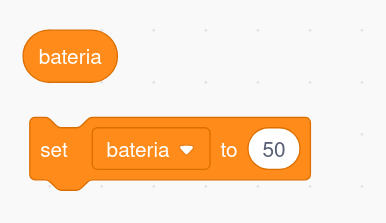
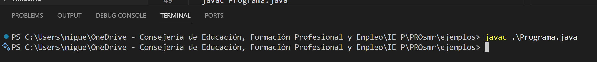

1. [Uso de VSC como IDE para java](../guias/vsc/vsc.md) 2. [Variables, Operaciones, Entrada/Salida y Conversiones](../guias/guia.md) 3. [Funciones](../guias/funciones/guiaFunc.md) 4. [Condicionales](../guias/condicional/condicional.md) 5. [Condicionales 2](../guias/condicional/condicioinalV2.md) 6. [Bucles con while](../guias/bucles/1while.md)
   
# 1 Guía Variables, Operaciones, Entrada/Salida y Conversiones en Java

- [1 Guía Variables, Operaciones, Entrada/Salida y Conversiones en Java](#1-guía-variables-operaciones-entradasalida-y-conversiones-en-java)
  - [1a. Crear variables con su tipo](#1a-crear-variables-con-su-tipo)
  - [1b. Dar valor a una variable](#1b-dar-valor-a-una-variable)
  - [2. Operaciones básicas](#2-operaciones-básicas)
  - [3. Mostrar mensajes al usuario: print](#3-mostrar-mensajes-al-usuario-print)
  - [4. Pedir datos al usuario (entrada por teclado)](#4-pedir-datos-al-usuario-entrada-por-teclado)
  - [5. Conversiones básicas](#5-conversiones-básicas)


## 1a. Crear variables con su tipo

En Java, **todas las variables deben tener un tipo**.
El tipo indica qué tipo de dato puede guardar la variable (número, texto, letra…).

| Tipo     | Qué guarda                      | Ejemplo de declaración     |
| -------- | ------------------------------- | -------------------------- |
| `int`    | Números enteros (sin decimales) | `int edad;`           |
| `double` | Números con decimales           | `double nota;`       |
| `String` | Textos o palabras               | `String nombre;` |
| `char`   | Una sola letra o símbolo        | `char inicial;`      |

📌 **Recuerda:**

* Los textos van entre **comillas dobles (" ")**.
* Las letras (`char`) van entre **comillas simples (' ')**.
* Cada línea termina con **punto y coma ( ; )**.

---
## 1b. Dar valor a una variable

El valor que le demos a la variable tiene que ser adecuado al tipo de la variable:

🧩 **Ejemplo:**

```java
edad = 20;
nota = 8.5;
nombre = "Laura";
inicial = 'L';
```


```java
int bateria; //declara la variable bateria de tipo entero
bateria = 50;
```

---
## 2. Operaciones básicas

Podemos operar con los datos guardados en las variables.

* Aritmética: `+`, `-`, `*`, `/`
* Concatenación de texto: `+`

**Ejemplo en Java:**

```java
int suma;
double division;
String saludo;

suma = 5 + 3;                // 8
division = 10 / 4.0;         // 2.5
saludo = "Hola " + nombre;   // "Hola Ana"
```
---

## 3. Mostrar mensajes al usuario: print

```java

        System.out.println("\n--- Datos introducidos ---");
        System.out.println("Edad: " + edad);
        System.out.println("Nota: " + nota);
        System.out.println("Nombre: " + nombre);
        System.out.println("Inicial: " + inicial);
```

---


## 4. Pedir datos al usuario (entrada por teclado)

Para leer datos que escribe el usuario, usamos un **objeto de tipo `Scanner`**.

1. Primero se **importa** la clase:

   ```java
   //arriba, fuera de nuestro programa
   import java.util.Scanner;
   ```
2. Luego se **crea el objeto**:

   ```java
   //dentro de nuestro programa
   Scanner sc = new Scanner(System.in);
   ```


3. Y después se **piden los datos** con diferentes métodos según el tipo:

```java
//se importa el Scanner, observa que está fuera del programa
import java.util.Scanner;

public class EjemploScanner {
    public static void main(String[] args) {
        //se crea un Scanner llamado sc, observa que está dentro del programa
        Scanner sc = new Scanner(System.in);

        //se declaran las varibles
        int edad;
        double nota;
        String nombre;
        char inicial;

        //el usuario da valor a las varibles, con un mensaje previo (Introduce tu edad...)
        System.out.print("Introduce tu edad: ");
        edad = sc.nextInt();

        System.out.print("Introduce tu nota: ");
        nota = sc.nextDouble();

        sc.nextLine(); // Limpiamos el buffer (la línea de la consola donde el usuario puede escribir, respondiendo a las preguntas) porque nextInt() y nextDouble() no leen el salto de línea, y puede afectar a la siguiente lectura de texto

        System.out.print("Introduce tu nombre: ");
        nombre = sc.nextLine();

        System.out.print("Introduce la inicial de tu nombre: ");
        inicial = sc.next().charAt(0);

    }
}

```

> Seguimos comparando con Scrath:

   


```java
    //Seguimos con el ejemplo de la batería (previamente se importó Scanner)

      Scanner sc = new Scanner(System.in); //Creo la estructura que me va a permitir leer la respuesta del usuario (se llama objeto, sc en este caso)

      int bateria; //creo la variable para almacenar el porcentaje de batería (que será un número entero)

      System.out.println("¿Qué porcentaje de carga tiene la batería en este momento?"); //mostramos un mensaje al usuario

      bateria = sc.nextInt(); //Almacena en bateria el número introducido por el usuario

   ```

[Más sobre limpiar el buffer](./amplia/limpiaBuffer.md)

---

## 5. Conversiones básicas

A veces es necesario transformar datos de un tipo a otro.

**Ejemplo en Java:**

```java
// int → double
int n = 5;
double d = (double) n; // 5.0

// double → int
double x = 7.9;
int y = (int) x; // 7

// String → int
String texto = "42";
int numero = Integer.parseInt(texto);

// int → String
int valor = 100;
String cadena = String.valueOf(valor);
```


🧩 **Ejemplo completo:**

```java
import java.util.Scanner;

public class Main {
    public static void main(String[] args) {
        Scanner sc = new Scanner(System.in);

        System.out.print("Introduce tu edad: ");
        int edad = sc.nextInt();

        System.out.print("Introduce tu nota: ");
        double nota = sc.nextDouble();

        sc.nextLine(); // limpia el salto de línea pendiente

        System.out.print("Introduce tu nombre: ");
        String nombre = sc.nextLine();

        System.out.print("Introduce la inicial de tu nombre: ");
        char inicial = sc.next().charAt(0);

        System.out.println("\n--- Datos introducidos ---");
        System.out.println("Edad: " + edad);
        System.out.println("Nota: " + nota);
        System.out.println("Nombre: " + nombre);
        System.out.println("Inicial: " + inicial);
    }
}
```

📤 **Ejecución típica:**

```
Introduce tu edad: 20
Introduce tu nota: 8.5
Introduce tu nombre: Laura
Introduce la inicial de tu nombre: L

--- Datos introducidos ---
Edad: 20
Nota: 8.5
Nombre: Laura
Inicial: L
```

