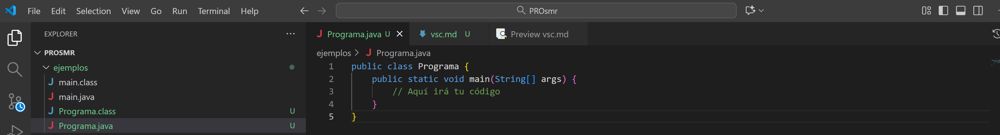
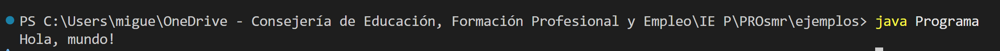

1. [Uso de VSC como IDE para java](../../guias/vsc/vsc.md) 2. [Variables, Operaciones, Entrada/Salida y Conversiones](../../guias/guia.md) 3. [Funciones](../../guias/funciones/guiaFunc.md) 4. [Condicionales](../../guias/condicional/condicional.md) 5. [Condicionales 2](../../guias/condicional/condicioinalV2.md) 6. [Bucles con while](../../guias/bucles/1while.md)

## Guía: Escribir, compilar y ejecutar programas Java en Visual Studio Code (sin extensiones)

### 1. Crear el archivo

* Abre **Visual Studio Code**.
* Crea una nueva carpeta para tus programas Java.
* Dentro de ella, crea un nuevo archivo llamado por ejemplo:

  ```
  Programa.java
  ```


### 2. Escribir la estructura básica

En el archivo escribe la estructura mínima de un programa Java:

```java
public class Programa {
    public static void main(String[] args) {
        // Aquí irá tu código
    }
}
```

⚠️ El **nombre del archivo** (`Programa.java`) debe coincidir **exactamente** con el **nombre de la clase pública** (`Programa`).

---

### 3. Escribir el programa

Añade dentro del método `main` las instrucciones que quieras ejecutar, por ejemplo:

```java
System.out.println("Bienvenido a Java");
```

Puedes guardar los cambios con **Ctrl + S**.

---

### 4. Compilar y ejecutar desde la terminal

1. Abre la **terminal integrada** en VSC (menú *Ver → Terminal* o `Ctrl + ñ`).

2. Escribe el siguiente comando para **compilar**:

   ```
   javac Programa.java
   ```


   Esto genera un archivo `Programa.class`.



3. Escribe el siguiente comando para **ejecutar**:

   ```
   java Programa
   ```

Verás en la terminal el resultado del programa.

